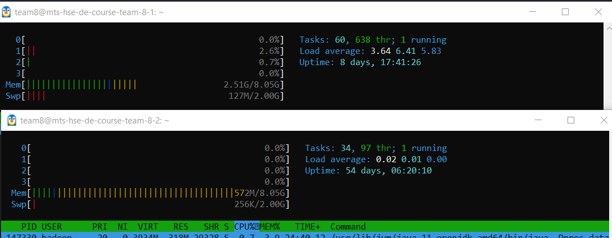
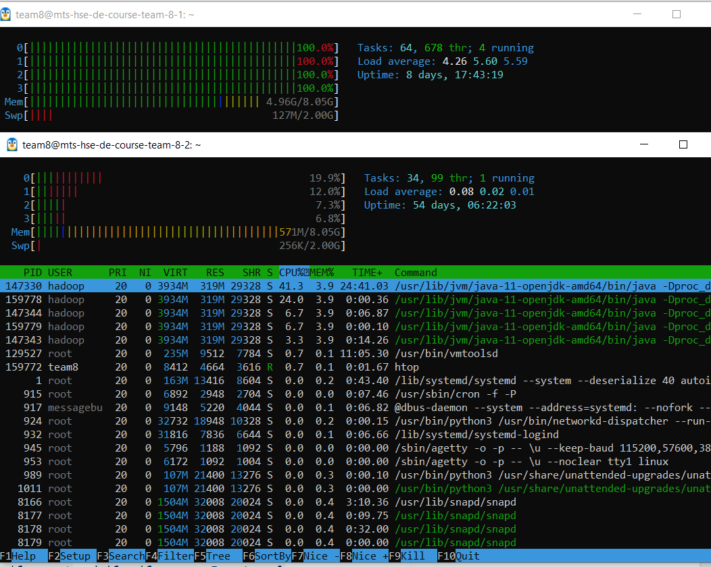
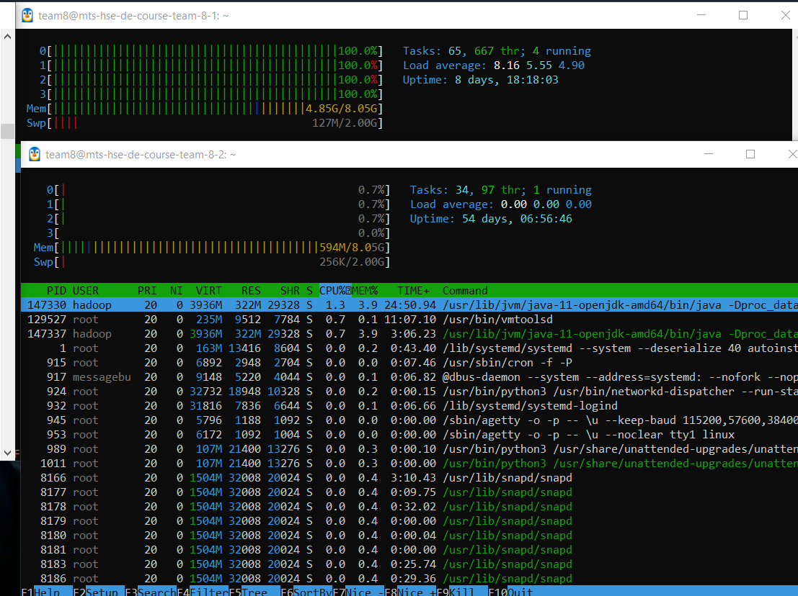

# до экспа:
- **нагрузка.** Сверху на мастере, снизу на воркере; т.к. мастер сам тоже реплицирует данные, то он NN+DN, воркер - DN:

- **fs.** [fs-image-1.txt](fs-image-1.txt)
- **history.** [edits-1.xml](edits-1.xml)

# загружаем файл в 1G:
- **нагрузка.** На мастере нагрузка на цпу явно больше почему-то из-за демона ssh, но в-целом мы можем наблюдать дифф:

- **fs.** [fs-image-2.txt](fs-image-2.txt) - добавился 1 файл в 8 блоков 
- **history.** [edits-2.xml](edits-2.xml) - видим, что добавились рекорды по производимым операциям (блок аллоцируется, выставляется таймстемп, блок добавляется)

# загружаем 1000 файлов в 1M:
- **нагрузка.** Та же причина нагрузки на цпу на мастере, но на воркере ресурсы утилизируются очень неэффективно, из-за чего и загрузка файлов происходит ужасно медленно (долго ждал):

- **fs.** [fs-image-3.txt](fs-image-3.txt) - видим, что файлы в 1мб занимают блоки в 128мб и их очень много
- **history.** [edits-3.xml](edits-3.xml) - вообще по ходу выгрузки и репликации успели сформироваться 3 эдита, в представленном файле их склеили в одну (где склейка - можно найти по `EDITS`). здесь можем увидить, как для каждого файла отдельно проделываются все эти "транзакции" (`OP_ADD,OP_ALLOCATE_BLOCK_ID,OP_SET_GENSTAMP_V2,OP_ADD_BLOCK,OP_CLOSE,OP_RENAME_OLD`), в то время как для большого файла в журнале повторяются записи только про блоки (`OP_ALLOCATE_BLOCK_ID,OP_SET_GENSTAMP_V2,OP_ADD_BLOCK`)

---
PS:

ВЫВОД: увидели, что хадуп не подходит для случаев с большим количеством записей маленьких файлов (неэффективно и по времени, и по пространству)

может быть полезно
- `hdfs oev -i <edit-file-name> -o <result-xml-path> -p XML`
- `hdfs oiv -p Delimited -i <fs-image-name> -o <result-xml-path>`
