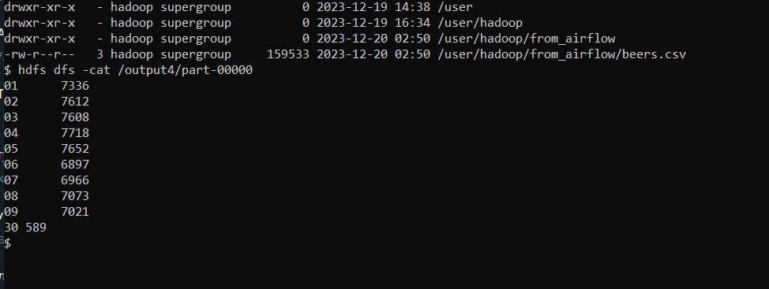

## map-reduce
dataset: https://www.kaggle.com/datasets/arevel/chess-games (`head -n 1800000`)

мапредьюс: считаем кол-во побед черных в блиц по числам месяца

результат: 

некоторые изменения конфигов (без этих изменений были проблемы с запусками): [instruct.md](instruct.md)

---

- Запуск локально (1 thread): 
    1. `cat <dataset> | python3 <map.py> | sort | python3 <reduce.py>`
    2. 32sec
- Запуск на standalone:
    1. убедиться, что в `/usr/local/hadoop/etc/hadoop/workers` один worker (`haddop1`). Если нет - изменить и перезапустить yarn.
    2. запустить maprecude с помощью команды

        `hadoop jar $HADOOP_HOME/share/hadoop/tools/lib/hadoop-streaming-*.jar -input <dataset> -output output -file <path/to/map.py> -mapper <map.py> -file <path/to/reduce.py> -reducer <reduce.py>`
    3. time elapsed: 87sec; aggregate resource allocation: 579826 MB-seconds, 308 vcore-seconds
- Запуск на cluster:
    1. убедиться, что в кластер включены все worker-ы
    2. запустить mapreduce той же командой, что и для standalone.
    3. time elapsed: 81sec; aggregate resource allocation: 1355241 MB-seconds, 1019 vcore-seconds

Аллокация ресурсов требует времени (возможно, можно аллоцировать более оптимальное количество контейнеров для stanalone/cluster решения). Про потребление ресуров: на большем объеме данных + более сложных метдах map/reduce между standalone и cluster решениями ожидается более явный дифф (и по сравнению с локальным запуском). Но в обеих случаях мы загрузили шедулер yarn-а на 100%.
